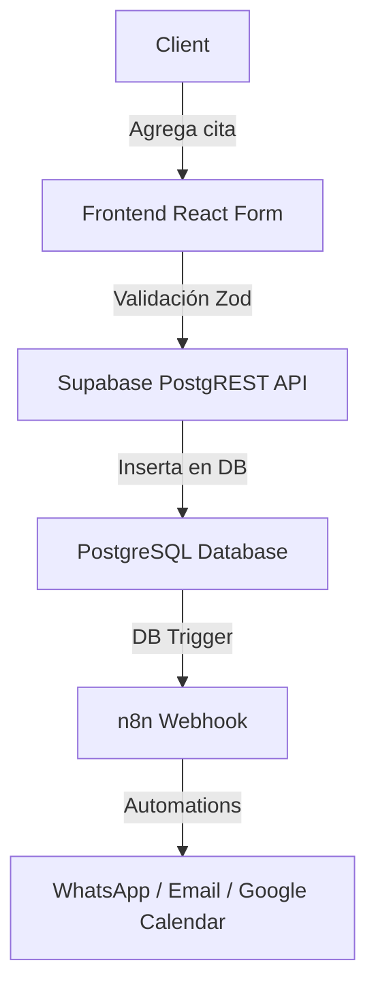

# ARCHITECTURE - VERTEX BOOKING

## Tech Stack
- Frontend: React 18 + TypeScript + Vite
- Backend: Supabase (PostgreSQL + Auth + Edge Fn)
- Integrations: n8n, Twilio, Google Calendar, Stripe
- Deployment: Vercel + Supabase Cloud
- CI/CD: GitHub Actions

## System Diagram

## Data Flow
1. Client agrega cita → Frontend form
2. Form validates (Zod) → Backend API
3. API inserta en Supabase
4. Trigger activa n8n webhook
5. n8n envía WhatsApp + email + calendar

## Database Design
- **businesses**: (owner, settings, timezone)
- **services**: (salon/taller services, duration, price)
- **bookings**: (main table, status, scheduled_at)
- **reminders**: (sent/failed logs)
- **audit_log**: (compliance, changes tracking)

## Security Model
- JWT auth via Supabase
- RLS policies por business_id
- Rate limiting (100 req/min por IP)
- Encryption en tránsito (TLS 1.3)

## Performance Targets
- API latency: <200ms p95
- DB query: <100ms p95
- Frontend Lighthouse: >85
- Uptime: 99.5% SLA
